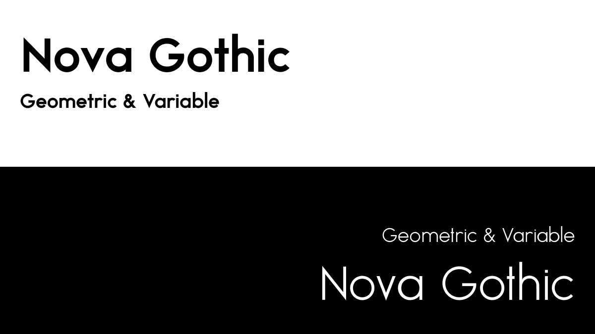
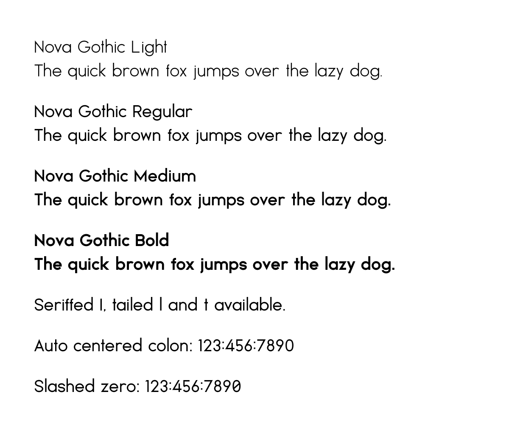

# Nova Gothic



**Nova Gothic** is a geometric sans-serif font featuring a variable weight axis, drawing inspiration from a diverse mix of both historic and modern typefaces, including but not limited to Futura, Century Gothic, DIN Pro, and Google Sans. Its design caters to a broad spectrum of applications, marrying the essence of classic typeface structure with the versatility demanded by contemporary design aesthetics.



**Note**: Nova Gothic is an evolving project, continually refined to enhance its design and extend language support.

## Language Coverage

Nova Gothic proudly offers expansive support for Latin languages—approximately 90%, covering major Western European languages like English, German, and French, Eastern European languages such as Polish, Turkish, and Czech, and even extending to Vietnamese in Southeast Asia. With plans to roll out Greek and Cyrillic support, the font aims to be ever more inclusive.

## OpenType Features

Nova Gothic comes packed with a range of OpenType features designed to enhance your typography work:

- **`calt`**: Centered Colon (auto)
- **`cv01`**: Seriffed uppercase `I`
- **`cv02`**: Tailed lowercase `l`
- **`cv03`**: Tailed lowercase `t`
- **`cv04`**: Centered Colon (overrides `calt`)
- **`zero`**: Slashed Zero

## How to Install

For the latest release, head over to the [Nova Gothic Release Page](https://github.com/Aaron-212/NovaGothic/releases). Download the zip, extract it, and you'll find the font distributed in two formats:

- **Static**: Includes four OTFs for different weights.
- **Variable**: Contains a variable OTF and a variable WOFF2 file for more flexibility in weight.

Choose according to your needs and follow the installation procedure for your system.

Nnightly builds are accessible via the GitHub Actions artifacts.

## Build Fonts Locally

**Warning**: Please note that our build process directly installs Python dependencies on your system. Proceed with caution!

Tested on:
- Ubuntu 22.04
- MacOS 14.4

Though untested elsewhere, scripts may still work.

**Setup**:

1. To install Python dependencies:
```sh
make init
```

2. To build the fonts:
```sh
make build
```

3. Optional: To zip up all font files:
```sh
make zip
```

## Roadmap and Current Focus

### Known Issues

- Bad sidebearings for certain glyphs
- Insufficient kerning pairs

### In Progress

- Expanding Latin support, including African languages
- Integration of Greek and Cyrillic alphabets

### Future Endeavors

- Arabic alphabet and ligatures
- Full IPA support
- Extensive ligature options
- Japanese, Korean, and CJK Ideographs
- Homebrew Install command / Google Fonts
